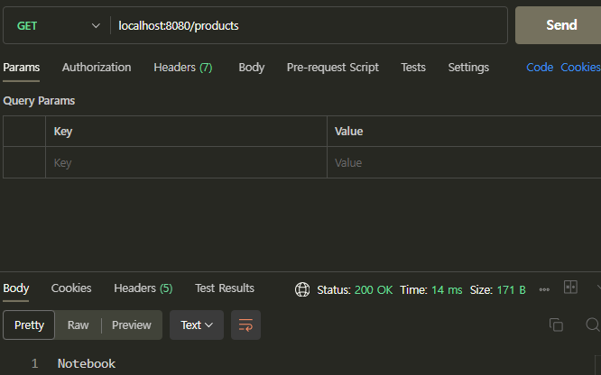

# Udemy 강의

- 옆집 개발자와 같이 진짜 이해하며 만들어보는 첫 Spring Boot 프로젝트 (김송아 강사)

## 목차

- [Section 1 - 시작](#section-1---시작)
- [Section 2 - 웹](#section-2---웹)
- [Section 3 - API](#section-3---api)
- [Section 4 - Spring](#section-4---spring)
- [Section 5 - 프로젝트 생성](#section-5---프로젝트-생성)
  - [Section 5: 프로젝트구조](#프로젝트-구조)
  - [스프링 주요 개념 (Core)](#스프링-주요-개념-core)
  - [Spring MVC](#spring-mvc)
  - [프로젝트 구동하기](#프로젝트-구동하기)
  - [Controller, Service, Repository 클래스 생성](#controller-service-repository-클래스-생성)
  - [자바 어노테이션](#자바-어노테이션)
  - [상품 등록, 조회 API 프로젝트](#상품-등록-조회-api-프로젝트)
  - [HTTP method](#http-method)
  - [서비스 추가해보기](#서비스-추가해보기)
- [Section 6 - 스프링 코어](#section-6---스프링-코어)
  - [스프링 IoC & 빈 등록 & DI 적용](#스프링-ioc--빈-등록--di-적용)
  - [Repository는 Map으로](#repository는-map으로)
  - [DI 3가지 방법](#di-3가지-방법)
- [Section 7 - 상품-등록하기](#section-7---상품-등록하기)
  - [REST API URL 규칙](#rest-api-url-규칙)
- [Section 8 - 테스트](#section-8---테스트)
- [Section 9 - 원하는 상품 등록하기](#section-9---원하는-상품-등록하기)
  - [@RequestParam](#requestparam)
  - [@PathVariable](#pathvariable)
- [Section 10 - 상품에 데이터 더 넣어보기](#section-10---상품에-데이터-더-넣어보기)
  - [@RequestBody](#requestbody)
- [Section 11 - 마무리](#section-11---마무리)

# [Section 1 - 시작](#목차)

프로젝트: 일정 기간 일정 목적을 달성하기 위한 업무 묶음 (프로세스)  
하나의 프로그램, 서비스 등을 완성하는 것뿐만 아니라 에러 해결, 기능 추가(수정)

# [Section 2 - 웹](#목차)

HTML: Hyper Text Markup Language  
HTTP: Hyper Text Transfer Protocol

# [Section 3 - API](#목차)

API: Application Programming Interface  
REST(ful) API: HTTP 규칙(틀), 필요한 데이터

URL: 웹에서 요청하는 방법 = API를 사용하는 방법

# [Section 4 - Spring](#목차)

Spring: 웹 프레임워크

라이브러리 vs 프레임워크  
프레임워크: 틀 안에서 해결 (이미 라이브러리 포함)


    Data Access: 데이터베이스와 소통할 수 있는 인터페이스
    Web: 웹 개발하는데 필요한 기술
    AOP: Spring의 큰 장점
    Core Container: 핵심 기술
    Test: Test 도구

Spring Boot: Spring 기반으로 설정을 쉽게 해줌

# [Section 5 - 프로젝트 생성](#목차)

- [프로젝트 구조](#프로젝트-구조)
- [스프링 주요 개념 (Core)](#스프링-주요-개념-core)
- [Spring MVC](#spring-mvc)
- [프로젝트 구동하기](#프로젝트-구동하기)
- [Controller, Service, Repository 클래스 생성](#controller-service-repository-클래스-생성)
- [자바 어노테이션](#자바-어노테이션)
- [상품 등록, 조회 API 프로젝트](#상품-등록-조회-api-프로젝트)
- [HTTP method](#http-method)
- [서비스 추가해보기](#서비스-추가해보기)

## [spring initializr](https://start.spring.io/)

프로젝트 만들어주는 사이트


Project: Gradle, Maven (빌드 도구)

    Gradle이 Maven보다 빌드가 조금 더 빠름
    Gradle - Groovy, Gradle - Kotlin (Gradle과 소통할 언어)

Packaging: Jar, War (압축파일 확장자)

    Jar: 웹서버(WAS)까지 포함해서 압축
    War: 그것을 빼고 압축

Dependencies: 사용할 것

REST API를 만들기 위해서는 가장 기본적인 것

> Spring Web

Build web: 웹을 만들거나
including RESTful: RESTful하게 만들거나  
Uses Apache Tomcat as the default embedded container

> Tomcat: WAS(Web Application Service) 브랜드

## [프로젝트 구조](#section-5---프로젝트-생성)

```
📦demo
 ┃ ┣ 📂resources
 ┃ ┃ ┗ 📂main
 ┃ ┃ ┃ ┣ 📂static
 ┃ ┃ ┃ ┣ 📂templates
 ┃ ┃ ┃ ┗ 📜application.properties
 ┣ 📂gradle
 ┃ ┗ 📂wrapper
 ┃ ┃ ┣ 📜gradle-wrapper.jar
 ┃ ┃ ┗ 📜gradle-wrapper.properties
 ┣ 📂src (source)
 ┃ ┣ 📂main
 ┃ ┃ ┣ 📂java
 ┃ ┃ ┃ ┗ 📂com
 ┃ ┃ ┃ ┃ ┗ 📂example
 ┃ ┃ ┃ ┃ ┃ ┗ 📂demo
 ┃ ┃ ┃ ┃ ┃ ┃ ┗ 📜DemoApplication.java
 ┃ ┃ ┗ 📂resources (src 이외)
 ┃ ┃ ┃ ┣ 📂static
 ┃ ┃ ┃ ┣ 📂templates
 ┃ ┃ ┃ ┗ 📜application.properties
 ┃ ┗ 📂test (tdd)
 ┃ ┃ ┗ 📂java
 ┃ ┃ ┃ ┗ 📂com
 ┃ ┃ ┃ ┃ ┗ 📂example
 ┃ ┃ ┃ ┃ ┃ ┗ 📂demo
 ┃ ┃ ┃ ┃ ┃ ┃ ┗ 📜DemoApplicationTests.java
 ┣ 📜build.gradle
 ┣ 📜gradlew
 ┣ 📜gradlew.bat
 ┣ 📜HELP.md
 ┗ 📜settings.gradle
```

src 폴더 안에는 main과 test 폴더가 있음  
test 폴더 -> TDD: 테스트를 기반으로 구현하는 프로젝트, 개발 방법  
로직을 짜는 곳은 src -> main -> java

resources 폴더: 소스코드 이외의 것 -> 화면(템플릿), 이미지(로고), 설정(properties) 등

> 설정: 자바로 데이터베이스 jdbc로 연결하려면 긴 코드..  
> 스프링을 이용하면 DB이름, 계정 정보만 설정 파일에 작성하면 끝

build.gradle 파일: gradle이 빌드할 때 보는 파일

> group: gradle과 소통하기 위한 그룹
> dependencies: 추가한 것들 (Spring Web)

gradlew, gradlew.bat: gradle로 빌드하기 위한 실행 파일  
gradlew(MAC), gradlew.bat(윈도우 배치 파일)

## [스프링 주요 개념 (Core)](#section-5---프로젝트-생성)

- IoC
- DI
- 컨테이너
- 스프링 빈

---

IOC(Inversion of Control)

제어의 역전
제어권을 갖고있다가 역전 -> 갖고있지 않음

어떤 제어권? 프로그램(객체)의 흐름을 제어

객체의 흐름: 객체 생성 -> 사용 -> ...  
원래 객체 생성 주체는 나: new Product()  
이제는 스프링

---

DI(Dependency Injection)

의존성 주입

의존한다 = 사용한다  
객체(의 메소드)를 사용한다.  
-> 먼저 객체 생성부터

내가 직접 객체를 생성해서 사용하는 것이 아닌
주입을 당해서 사용

---

컨테이너

공간: 스프링이 객체를 생성해서 관리하는 공간

IoC를 위한 컨테이너, DI를 위한 컨테이너...

의존성 주입해줘 -> 컨테이너에서 객체를 찾아서 전달

스프링이 관리하는 객체: 스프링 빈(bean)

---

정리

IoC를 구현하기 위해 DI가 필요하다.

스프링 빈: 스프링(이 컨테이너에 담아놓고 관리하는) 객체

IoC (제어의 역전): 프로그램의 흐름을 제어하는 주체가 정반대로 바뀜  
= 객체의 흐름을 제어하는 주체가 정반대로 바뀜  
= 스프링 빈의 흐름을 제어하는 주체가 정반대로 바뀜

컨테이너 (a.k.a IoC, DI, 스프링): 스프링 빈을 담아두는 공간

DI (의존성 주입): 우리는 의존성을 주입 당하는 역할  
= 스프링은 의존성을 주입 하는 역할

## [Spring MVC](#section-5---프로젝트-생성)

스프링 MVC: Controller - Service - Repository

- Model: 데이터 처리(연산), 로직

  > 데이터를 가지고 연산을 하려면 데이터가 필요(데이터 베이스랑 소통)  
  > 모델은 단순히 로직만 수행하는 것이 아니라 로직에 필요한 데이터까지 처리  
  > 클래스명을 로직을 담당하는 Service라는 클래스(계층)이 있고,  
  > 데이터(베이스)와 소통하는 Repository 모델이 있음  
  > (계층, 클래스) Service / Repository

- View: 화면

  > 스프링은 화면도 만들 수 있음  
  > 근데 최근은 api 용도로만 쓰고  
  > 그 api도 화면을 보내주는 api가 아닌  
  > 데이터만 정해서 보내주는 api (REST API)  
  > 요즘은 화면을 스프링에서 잘 안쓰는 추세

- Controller : Model - View 중간 매개체
  >            Model - 사용자 중간 매개체
  >
  > View는 잘 안쓰는 추세  
  > View는 사용자(클라이언트)가 화면을 보니까  
  > 컨트롤러는 모델과 사용자 중간 매개체  
  > 사용자가 요청하면 그에 맞는 모델의 로직을 호출  
  > 그 로직은 결과를 내서 컨트롤러한테 반환  
  > 컨트롤러는 사용자에게 반환

## [프로젝트 구동하기](#section-5---프로젝트-생성)


`Tomcat initialized with port 8080 (http)`

Tomcat: 인터넷 통신망 사이의 가상 웹 공간  
Tomcat을 초기화한다. 8080 포트로. http 프로토콜을 사용

[http://localhost:8080](http://localhost:8080)


type=Not Found  
url을 요청했는데 그 url에 대응할 만한 서비스가 아직 없어서 에러  
(http에는 url을 담아서 보냄. url은 localhost:8080)

## [Controller, Service, Repository 클래스 생성](#section-5---프로젝트-생성)


Controller, Service, Repository는 하나의 클래스로 각각 사용

컨트롤러는 요청을 받아서 일을 시키고 그 결과를 돌려줌
(일은 서비스한테 시킴)

서비스는 일을 하기 위해서 데이터가 필요
데이터베이스에서 데이터를 저장하고 수정
(서비스는 레파지토리한테 데이터를 불러오거나 저장 요청)

레파지토리는 데이터베이스와 소통

## [자바 어노테이션](#section-5---프로젝트-생성)

`@SpringBootApplication`

어노테이션을 이해하기 위해선 오버라이드 개념부터

`OverrideDemo.java` 예시

```java
class Parent {
  void method() {

  }
}

class Child extends Parent {

}
```


Child 클래스는 Parent를 상속받아 method() 함수 존재

```java
class Parent {
  void method() {

  }
}

class Child extends Parent {
  void method() {

  }
}
```

오버라이드 했음


만약에 method에 h를 빼먹으면 오버라이드가 아님  
새로운 메소드 metod를 생성한 것  
이런 실수를 했다면 `@Override`를 통해 에러를 찾을 수 있음  
어노테이션의 역할은 다양함 (코드생성, 오류찾기 등)

## [상품 등록, 조회 API 프로젝트](#section-5---프로젝트-생성)

Recall

> 프로젝트: 특정 요구사항을 수행할 수 있는 프로그램 결과

상품 등록과 조회만 할 수 있는 API 만들기 (백엔드)

패키지 구조 설계 생각하기

상품 등록과 조회 -> 상품에 초점

> 설계 기법 중 DDD(Domain Driven Development)
> 설계뿐만 아니라 모든 개발 프로세스에 도메인 단위로 하기
> 도메인: 문제 해결 단위, (ㅇㅇ) 서비스 <- ㅇㅇ이 도메인


product 패키지 만들기  
클래스 파일명 바꾸기

ProductController.java

@Controller를 넣어줘야 컨트롤러 역할을 수행

`Controller.class`

> It is typically used in combination with annotated handler methods based on the  
> {@link org.springframework.web.bind.annotation.RequestMapping} annotation.

어떤 결합으로 함께 이용됩니다.
핸들러 역할을 하는 메소드
RequestMapping 어노테이션과 같이 사용

핸들러: 요청이 날라오면 그 요청에 맞는 메소드를 호출

컨트롤러는 요청이 날라오면 메소드를 실행

`@RequestMapping`
() 내용에 맞는 요청이 들어오면 아래 메소드를 실행

Recall

> Http 틀에는
>
> 1. URL: http://localhost:8080
> 2. 목적: 조회, 등록, 수정 (method=RequestMethod.GET)
> 3. 데이터: body

```java
@RequestMapping(value = "http://localhost:8080", method = RequestMethod.GET)
    public String findProduct() {
        return "NoteBook";
    }
```

`@RequestMapping` 어노테이션 안 속성에는  
이런 url이 날라오고, 목적이 요청이면 아래 메소드 실행  
url에 http://localhost:8080는 기본값으로 생략해도 무방

findProduct 메소드를 실행하는데 반환하는건  
화면이 아닌 **데이터**

데이터를 던지는 것은 그냥 API가 아닌 REST API  
데이터를 어디서 담아서 옮길지 (body)

클라이언트한테 요청을 받으면 "Notebook"이라는 데이터 전달  
즉, REST API
데이터를 전달하려면 ResponseBody라는 틀에 담아서 전달

그냥 @Controller만 있으면 View를 전달해주는 API  
@ResponseBody 어노테이션이 있어야 REST API 역할

## [HTTP method](#section-5---프로젝트-생성)

HTTP 목적

1. 조회: GET
2. 등록(생성): POST
3. 수정: 전체 수정 - PUT
   - 부분 수정 - PATCH
4. 삭제: DELETE

## [서비스 추가해보기](#section-5---프로젝트-생성)

```java
@RequestMapping(value = "", method = RequestMethod.GET)
    public String findProduct() {
        ProductService productService = new ProductService();

        return "NoteBook";
    }
```

컨트롤러는 서비스에게 일을 시키고 서비스에게 받은 값을 전달하는 역할
서비스에게 일을 시키기 위해서는 객체가 있어야 함
`ProductService productService = new ProductService();`
ProductService는 findProduct에 대응할 만한 로직(메소드)이 아직 없음

서비스에는 RequestMapping이 없음 <- 컨트롤러꺼

# [Section 6 - 스프링 코어](#목차)

- [스프링 IoC & 빈 등록 & DI 적용](#스프링-ioc--빈-등록--di-적용)
- [Repository는 Map으로](#repository는-map으로)
- [DI 3가지 방법](#di-3가지-방법)

## [스프링 IoC & 빈 등록 & DI 적용](#section-6---스프링-코어)

IoC: 제어권을 스프링한테 넘김  
아직까지는 우리가 직접 객체를 생성함  
`ProductService productService = new ProductService();`  
객체에 대한 제어권을 우리가 들고있음

우리가 직접 객체를 생성하는 대신
스프링이 객체를 생성 등 관리하라고 요청

-> 내가 객체 만드는 틀(클래스) 제공해줄테니까
클래스보고 객체 생성 알아서 해주고
내가 필요할 때마다 알아서 넣어줘

스프링은 객체(빈)을 생성해서 컨테이너에 담아놓고
우리가 필요할 때마다 꺼내서 사용
= 스프링 빈(스프링이 관리하는 객체)으로 등록해줘
-> @Compoennt, @Configuration + @Bean

등록된 빈을 사용하게 주입해줘(의존성 주입) -> @Autowried

IoC를 위해서 스프링 빈(컨테이너에 있는 자바 객체)으로 등록
그것을 꺼내서 의존성 주입까지

@Component를 달면 객체 생성을 직접 하지 않고도 주입을 받아서 사용 가능
@Controller에도 @Component가 있음  
컨트롤러도 스프링 빈으로 등록

@SpringBootApplication에는 Component를 찾아주는 기능이 있음

## [Repository는 Map으로](#section-6---스프링-코어)

```java
@Service
public class ProductService {

    public String findProduct() {
        return "NoteBook!!";
    }
}
```

"NoteBook!!"은 데이터
서비스는 연산 로직을 하는 역할
데이터베이스에서 직접 데이터를 꺼내오진 않음

데이터는 레파지토리에서 꺼내옴
레파지토리도 빈으로 등록 @Repository

이번에는 DB 대신 Map 사용

| Id  | Name   | Age  |
| --- | ------ | ---- |
| 1   | 민지   | 18세 |
| 2   | 하니   | 18세 |
| 3   | 다니엘 | 17세 |
| 4   | 해린   | 16세 |
| 5   | 혜인   | 14세 |

Map은 자바의 자료구조  
테이블 형태
Map은 key 값을 가지고 value를 찾을 수 있는 자료구조

@Repository에도 @Component가 존재 (스프링 빈으로 등록)

## [DI 3가지 방법](#section-6---스프링-코어)

1. 필드로 주입

```java
   @Autowired
   필드
```

필드의 값을 바꿀 수 있는 메소드는 없어서 불변성은 지켜지겠지만  
테스트할 때도 그래서 불편 (test1 -> test2로 하고 싶어도 못함)

2. Setter로 주입

```java
  @Autowired
  public setter 메소드
```

setter는 보통 public으로 열려있어서 누구나 접근 가능
의존성 주입을 받아도 나중에 바꿀 수 있어 잘 안쓰임

3. 생성자로 주입

```java
  @Autowired
  생성자
```

생성자 위에 @Autowired  
생성자는 테스트할 때 생성자에 담아 원하는 타입, 구현체를 유도할 수 있음

# [Section 7 - 상품 등록하기](#목차)

- [REST API URL 규칙](#rest-api-url-규칙)

```java
    public String findProduct() {
        return db.get(1);
    }

    public void save() {
        db.put(id++, "Notebook");
    }
```

Repository에서 저장과 조회 수정

```java
    public void saveProduct() {
        productRepository.save();
    }
```

서비스에서 비즈니스 로직 구현

```java
    // 상품 등록
    @RequestMapping(value = "", method = RequestMethod.POST)
    public void saveProduct() {
        productService.saveProduct();
    }
```

컨트롤러에 이 조합으로 요청이 오면 아래 메소드를 호출  
saveProduct를 호출하면 서비스에 있는 메소드를 호출

## [REST API URL 규칙](#section-7---상품-등록하기)

```java
    @RequestMapping(value = "", method = RequestMethod.GET)
    @RequestMapping(value = "", method = RequestMethod.POST)
```

url이 같아도 목적이 다르면 구분

- 상품 조회 (method = GET)
  localhost:8080/product_select? get_product? X
  localhost:8080/products

- 상품 등록 (method = POST)
  localhost:8080/product_create? save_product? X
  localhost:8080/products

상품 조회에서 http 메소드 역할은 "조회" = GET, 등록은 POST  
url과 메소드 조합으로 찾는데, 메소드는 구분이 되므로 상품에 초점
보통은 복수형으로 많이 쓰임 (상품 전체 조회, 상품 단위 조회 등)

# [Section 8 - 테스트](#목차)

log를 찍어보는 것이 좋다. sout은 사용자에게 화면을 보여줄 때 사용  
시스템 내부적으로 데이터를 확인할 때는 log

## Postman


Status: 200 OK

http가 들고있는 값 중에 url, 메소드, body 외에 status code가 있음



# [Section 9 - 원하는 상품 등록하기](#목차)

- [@RequestParam](#requestparam)
- [@PathVariable](#pathvariable)

요청을 받을 때 데이터도 같이 받는 방법

1. HttpServletRequest
2. @RequestParam
   `http://localhost:8080/products?name=__`
3. @RequestBody
   `http://localhost:8080/products`
4. @ModelAtrribute
5. @PathVariable
   `http://localhost:8080/products/{id}`

## [@RequestParam](#section-9---원하는-상품-등록하기)

? 뒤 들어가는 변수는 개인정보는 피할 것

```java
    @RequestMapping(value = "/products", method = RequestMethod.POST)
    public void saveProduct(@RequestParam(value = "name") String productName) {
        System.out.println("POST");
        productService.saveProduct(productName);
    }
```

productName을 받아서 서비스에게 전달  
RequestParam 방식을 사용하면 알아서 String으로 전달

## [@PathVariable](#section-9---원하는-상품-등록하기)

정해진 건 없지만  
RequestParam: 입력을 받는 값, ? 가 있는 쿼리 스트링  
PathVariable: 정해진 값을 조회, /{id}

```java
    @RequestMapping(value = "/products/{id}", method = RequestMethod.GET)
    public String findProduct(@PathVariable("id") String id) {
        System.out.println(id);
        return productService.findProduct();
    }
```

String id 말고 int id도 주소에 잘 입력됨

```java
    private int id = 1;

    public String findProduct(int idx) {
        return db.get(idx);
    }
```

지역변수랑 필드 값과 구분되겠지만 매개변수를 idx로 변경  
get 메소드는 없는 idx를 입력해도 None 값을 반환  
-> 예외처리 해서 없는 id라는 것을 사용자에게 알림

# [Section 10 - 상품에 데이터 더 넣어보기](#목차)

- [@RequestBody](#requestbody)

## [@RequestBody](#section-10---상품에-데이터-더-넣어보기)

지금까지는 상품명만 입력하고 조회하는 것을 알아봄
상품명 뿐만 아닌 가격 등까지 입력하는 방법
하나의 세트로 입력하기

객체 지향 프로그램에서 세트로 다닐 수 있는 방법 = 객체

RequestBody는 http 틀에 들어가는 url, 목적, body 중 body에 들어감

`Product.java`

Product 객체에는 이름, 가격, 설명이 들어감

```java
// ProductController
    @RequestMapping(value = "/products", method = RequestMethod.POST)
        public void saveProduct(@RequestBody Product product) {
        System.out.println("POST");
        productService.saveProduct(product);
    }
// ProductRepository
    public void save(Product product) {
        System.out.println(product.getName());
    }
// Product: `Ctrl+.` -> Generate Getters and Setter
    public String getName() {
        return name;
    }
```

## JSON

Java Script Object Notation  
자바 스크립트 객체 형태

자바에서는 객체를 다음과 같이 객체 생성

```java
Product product = new Product();
```

자바 스크립트는 다음과 같이 객체 생성

```js
var product = {
  name: "handcream",
  price: 15000,
};
```

자바 스크립트는 key-value로 형성  
name과 price를 불러오는 방법  
`product.name`, `product.price`

자바 스크립트 -> 화면단에서 JSON 형태  
자바 -> 백엔드에서 객체 형태
형태가 같아서 중간에서 Mapping이 가능
그래서 화면에서 객체로 보낼 수 있는 것

@RequestBody 어노테이션이  
중간에서 자바스크립트에서 건너온 객체를
이름만 맞다면 하나씩 맞춰서 알아서 담아줌

-> `HTTP 메시지 컨버터` 검색

메시지 컨버터 덕분에 자바스크립트 객체가 와도 자바 객체로 변환할 수 있다.


## Repository 고도화하기

```java
// ProductRepository
    private Map<Integer, Product> db = new HashMap<>();

    private int id = 1;

    public Product findProduct(int idx) {
        return db.get(idx);
    }

    public void save(Product product) {
        db.put(id++, product);
        System.out.println(product.getName());
    }
```

db 반환값을 String에서 Product 객체로 수정
-> 서비스 반환값 수정 -> 컨트롤러 반환값 수정

# [Section 11 - 마무리](#목차)

다음 목표

- 상품 수정, 삭제
- @Configuration + @Bean
- Entity vs DTO
- DB 연결 (JPA)
- AOP

스프링 빈 등록할 때 @Component 방법만 써봤는데 @Configuration + @Bean도 써보기

Product 객체를 가지고 컨트롤러부터 레파지토리까지 가게 했는데 DTO는 무엇일까?

- Product = Entity 객체 이름
  계층을 움직일 때 Entity가 아닌 DTO로 움직인다.
