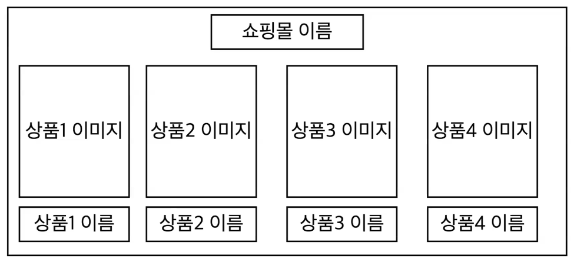
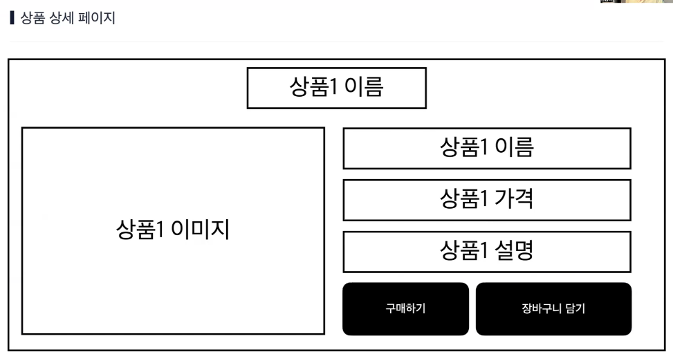
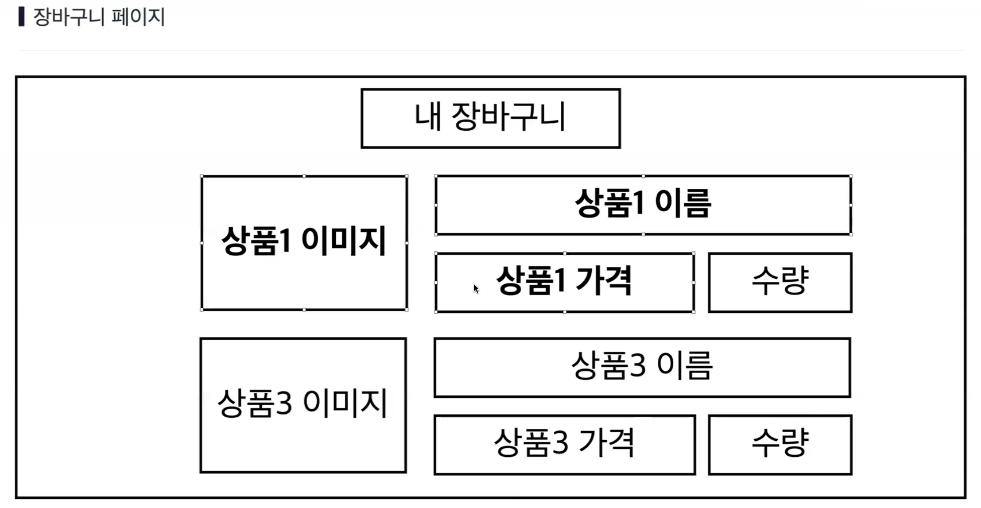
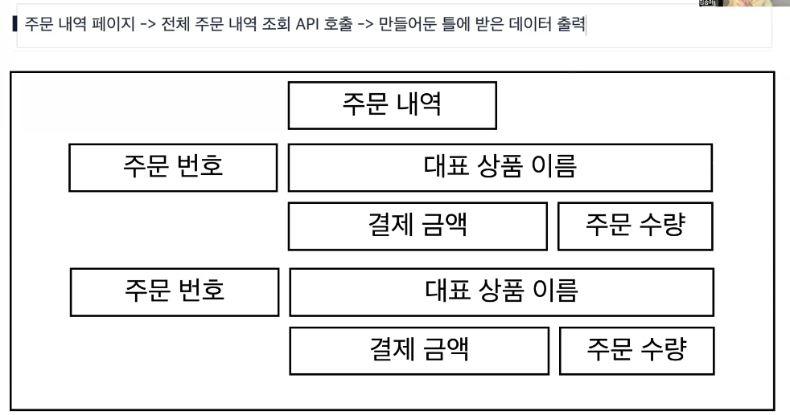
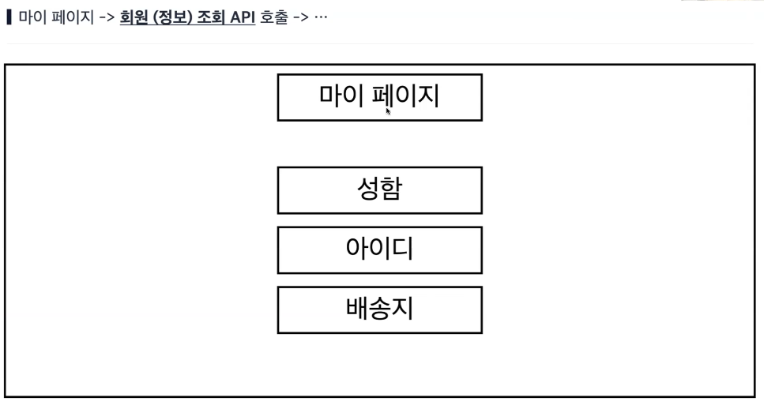
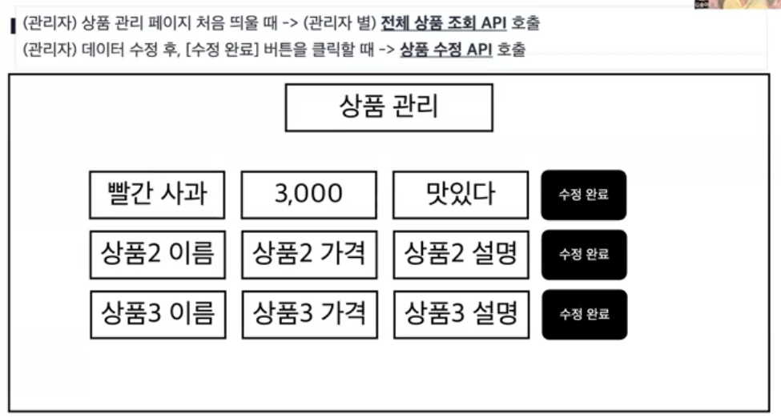

# Udemy 강의

- 옆집 개발자와 같이 진짜 이해하며 만들어보는 첫 Spring Boot 프로젝트 1.5탄 (김송아 강사)

## 목차

- [Section 1 - 시작](#section-1---시작)
- [Section 2 - 웹 백엔드 개발자](#section-2---웹-백엔드-개발자)
- [Section 3 - 상품 API](#section-3---상품-api)
  - [REST API URL 설계 고도화](#rest-api-url-설계-고도화)

# [Section 1 - 시작](#목차)

목표

1. 백엔드 개발자의 역할, 개발 용어들(DDD, 클린 코드)
2. Json array, xml
3. DB 설계, JPA 쓰는 이유, Entity - DTO

그 외) AOP, 예외 처리, 유효성 검사, Security, 자바+객체 지향

# [Section 2 - 웹 백엔드 개발자](#목차)

- [페이지](#페이지)
- [API 분리(DDD)](#api-분리ddd)

## [페이지](#section-2---웹-백엔드-개발자)

프론트엔드는 언제 어디서 어떻게 백엔드를 사용하는가?



이 페이지를 프론트엔드에서 화면단을 구성하는데 어떤 백엔드 API를 호출하는가?

쇼핑몰 메인 페이지 -> **전체 상품(정보) 조회 API** 호출 -> 전체 상품 데이터 받기 -> 받은 데이터를 화면에 뿌려줌



이 상세 페이지를 만들려면 프론트엔드는 어떤 백엔드 API가 필요할까?

상품 상세 페이지 -> **상품1 개별 (정보) 조회 API** 호출 -> 데이터 받기 -> 화면에 뿌려줌



이 장바구니 페이지를 만들려면?

장바구니 페이지 -> **장바구니 조회 API** 호출 -> 데이터 받기 -> 화면에 뿌려줌

> 프론트엔드는 틀을 만들고 백엔드 데이터를 기다린다.



주문 내역 페이지 -> **전체 주문 내역 조회 API** 호출 -> 만들어둔 틀에 받은 데이터 출력



마이 페이지 -> **회원(정보) 조회 API** 호출 -> ...



(관리자) 상품 관리 페이지 처음 띄울 때 -> (관리자 별) **전체 상품 조회 API** 호출

프론트엔드가 백엔드에게 A에서 A`로 수정해줘 -> 수정하는 것은 언제 호출될까?

(관리자) 데이터 수정 후, [수정 완료] 버튼 클릭 -> **상품 수정 API** 호출

## [API 분리(DDD)](#section-2---웹-백엔드-개발자)

필요한 API들

- 전체 상품 조회
- 개별 상품 조회
- 주문 조회
- 장바구니 조회
- 회원 정보 조회
- (관리자) 전체 상품 조회
- 상품 수정
- 상품 삭제

---

API 분리

상품 API

- 전체 상품 조회
- 개별 상품 조회
- (관리자) 전체 상품 조회
- 상품 수정
- 상품 삭제

---

주문 API

- 주문 조회
- 주문 삭제

---

장바구니 API

- 장바구니 조회
- 장바구니 아이템 삭제

---

회원 API

- 회원 정보 조회
- 회원 정보 수정

---

상품, 주문, 장바구니, 회원
-> 쇼핑몰 웹사이트를 만드는데 대표적인 도메인

문제(사용자가 원하는 기능) 해결하는 영역  
= 비즈니스 서비스 단위  
cf. 도메인 기반(주도) 설계(구현): DDD

> 문제란? Problem이 아닌 사용자가 원하는 기능  
> 문제를 해결한다는 것은 사용자가 원하는 기능을 구현해주는 것

회사 안에서 운영하는 서비스(사업)는 사용자가 원하는 기능을 제공하기 위함
문제를 해결해주기 위한 서비스를 제공

사용자가 원하는 기능을 해결하는 영역을 **도메인**

보편적으로 사용하는 도메인 단위는 상품 주문 등이 있지만 더 세분하게  
소비자용 상품 조회, 관리자용 상품 조회를 묶어서 상품 조회 도메인으로

도메인은 크기 별로 상위 도메인, 하위 도메인 등 다양한 기준과 영역이 있다.

# [Section 3 - 상품 API](#목차)

- [REST API URL 설계 고도화](#rest-api-url-설계-고도화)

상품 API에서 소비자는 전체(개별) 상품 조회만 사용  
전체 상품 조회, 수정, 삭제는 관리자의 것

> 소비자 입장이 자연스럽다보니  
> 소비자 역할에 대한 API를 만든 후에  
> 관리자 API를 만드는 게 더 빠를수도?

## [REST API URL 설계 고도화](#section-3---상품-api)

전체 상품 조회 추가

```java
// 개별 상품 조회
    @RequestMapping(value = "/products/{id}", method = RequestMethod.GET)
    public Product findProduct(@PathVariable("id") int id) {
        System.out.println(id);
        return productService.findProduct(id);
    }
```

[소비자 역할]

- 전체 상품 조회 (method = GET)  
  `localhost:8080/products`

- 개별 상품 조회 (method = GET)  
  `localhost:8080/products/{id}`

[관리자 역할]

- 상품 등록 (method = POST)  
  `localhost:8080/products`

### 내 컴퓨터는 서버가 될 수 있을까?

클라이언트 vs 서버

클라이언트(고객): 음식을 주문(요청)하는 사람  
서버(제공자): 음식을 가져오는 사람

-> 클라이언트: 정보를 요청하는 역할의 컴퓨터
-> 서버: 원하는 연산/정보를 제공하는 역할의 컴퓨터

서버가 될 수 있으나 계속 전원을 켜야 함

### 줄임말

1. @Controller + @ResponseBody: REST API

REST API란? HTTP 약속을 지킨 API  
인터넷에서 HTTP 틀을 지켜야 웹을 갈 수 있음

-> @RestController

2. @RequestMapping(value="", method="")

-> @GetMapping, @PostMapping, @DeleteMapping

# [Section 4 - 전체 상품 조회하기](#목차)


프론트엔드에서는 여러 개의 데이터를 받을 땐 리스트 형태로 받는게 사용하기 편하다.

```java
    // 전체 상품 조회
    @GetMapping("/products")
    public List<Product> findProductList() {
        return productService.findProductList();
    }
```

### 클린 코드: 메소드명

전체 상품 조회: `public List<Product> findProductList()`

1. 명사 vs **동사** -> 동작, 기능, 행위
   자바에서 메소드는 동작을 나타냄

2. find ProductList
   1. List: 반환 타입으로 표현 가능
   2. 의미만 제대로 담고 있으면 된다. (굳이 구조를...)

-> `public List<Product> findProducts()`

객체는 JSON 형태로 넘어간다. 객체들은 리스트로 (JSON array)

# [Section 5 - 스프링 빈을 등록하는 방법](#목차)

스프링이 특정 클래스로 일을 시키려면...
-> 스프링 빈으로 등록이 되어야만 스프링은 그 코드로 일을 한다.
