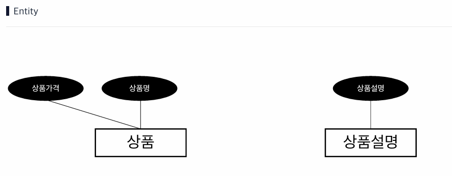
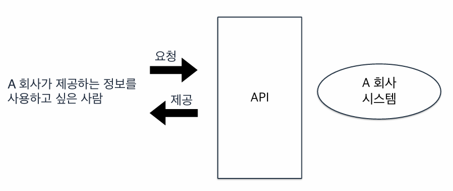
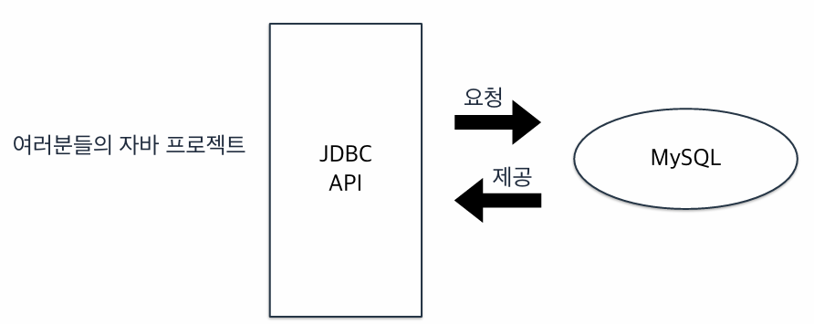
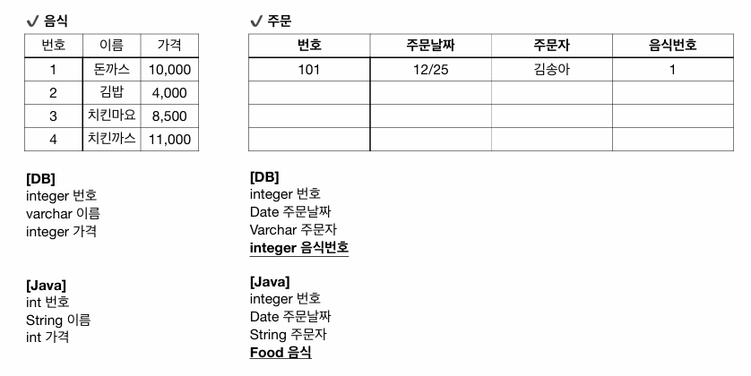
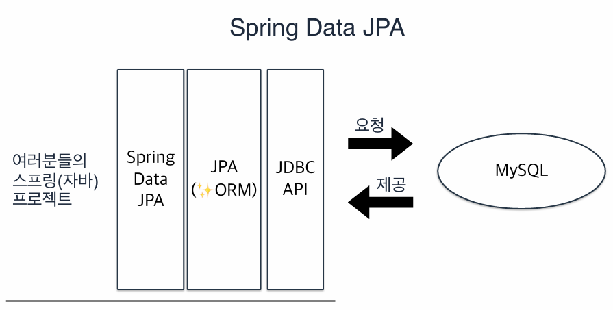
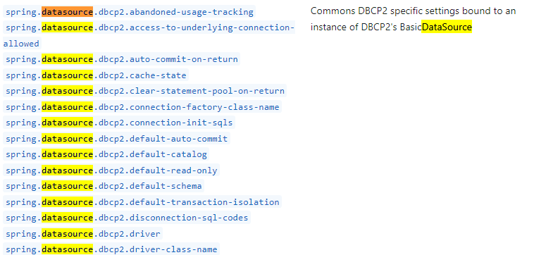
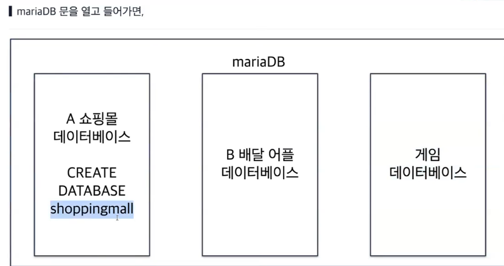
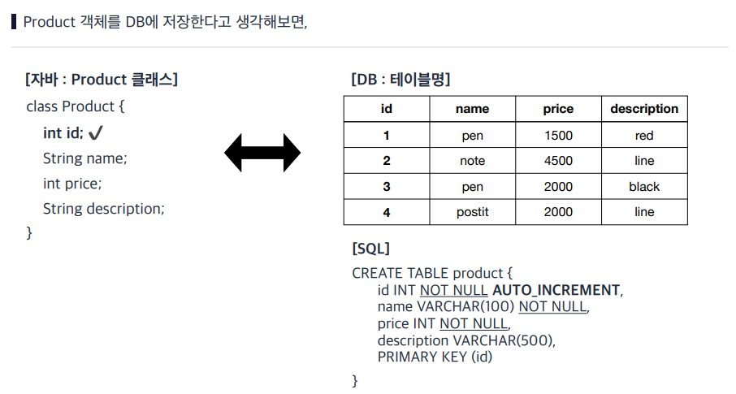

# Udemy 강의

- [옆집 개발자와 같이 진짜 이해하며 만들어보는 첫 Spring Boot 프로젝트 (김송아 강사)](README.md)
- [옆집 개발자와 같이 진짜 이해하며 만들어보는 첫 Spring Boot 프로젝트 1.5탄 (김송아 강사)](README1.5.md)
---
- 옆집 개발자와 같이 진짜 이해하며 만들어보는 첫 Spring Boot 프로젝트 2탄 (김송아 강사)

## 목차

- [Section 1 - 시작](#section-1---시작)
- [Section 2 - DB를 쓰는 이유](#section-2---db를-쓰는-이유)
- [Section 3 - 도커란?](#section-3---도커란)
- [Section 4 - ERD](#section-4---erd)
- [Section 5 - JPA](#section-5---jpa)
- [Section 6 - Spring Data JPA](#section-6---spring-data-jpa)
  - [DB 연결하기 - properties](#db-연결하기---properties)
- [Section 7 - JDBC API](#section-7---jdbc-api)
  - [build.gradle](#buildgradle)
- [Section 8 - JPA](#section-8---jpa)
  - [hibernate](#hibernate)
- [Section 9 - 전체 조회](#section-9---전체-조회)

---

# [Section 1 - 시작](#목차)

목표

- DB, ERD, JPA, Spring Data JPA, Entity, DTO

# [Section 2 - DB를 쓰는 이유](#목차)

데이터 베이스란? 데이터가 모여있는 공간?
-> 메모장, 블로그, 공책도 데이트 베이스인가?

저장하는 이유는 나중에 사용할 때, 빠르고 쉽게 효율적으로 찾고 사용하고 싶어서  
메모장, 블로그, 공책은 찾는데 오래 걸릴 수 있음

- 중복: 이전에 썼던 내용을 피할 수 있음
- 안전: 공책은 잃어버릴 수 있음
- 보안: 공책은 남들이 볼 수 있음
- 데이터 신뢰할 수 있도록 역할
  ex. 이름 값에 숫자형을 넣으면 에러 발생

데이터 베이스란  
검증된 데이터가 체계적으로 모여있어서 (= 중복 X, 보안, 정확)  
나중에 사용할 때, 효율적으로 데이터를 찾아서 쓸 수 있는 공간

### DB vs DBMS

사용자가 DB를 쉽게 사용할 수 있는 인터페이스 -> DBMS

RDBMS  
Relational DBMS: 데이터들의 관계가 DB의 핵심

DBMS 설치 시 **도커**로도 할 수 있다.

# [Section 3 - 도커란?](#목차)

컨테이너를 만들고 실행하는 기술

컨테이너란?  
어플리케이션(프로그램) + 환경 설정 세팅

기존에 프로그램을 설치하려면 설치 파일부터 환경설정 등 하나씩...  
환경설정까지 끝난 프로그램을 하나의 컨테이너 공간에 담아 둠

도커는 컨테이너를 내 컴퓨터에 도킹시켜줌

# [Section 4 - ERD](#목차)

Entity Relationship Diagram: 개체 - 관계 도식

Entity(개체): DB에서 하나의 표(row)에 저장하는 단위

ex. 상품명, 상품 가격, 상품 설명 / 회원 이름, 회원 아이디, 회원 비밀번호  
상품과 회원 분리



개체를 어떻게 분리하느냐(정규화) <— 이 단위에 따라서, 관계 형성

상품 - (상품가격,상품명,상품설명)  
분리를 한다고 무조건 좋은 것은 아니다.

# [Section 5 - JPA](#목차)

JPA와 DB가 연결되는 방법





Java DataBase Connectivity



자바는 객체 지향  
음식은 객체로 존재할 수 있다.  
(int 음식번호 -> Food 음식)

객체 지향과 관계 데이터베이스의 패러다임 불일치  
이를 해결해주는 것이 JPA

### JPA란?

Java Persistence API  
자바 지속성/영속성 API (영원히 지속되는 성질)  
자바(의 객체)가 JVM 밖에서도 지속되길 원함  
-> 데이터베이스에 저장해둘 수 있을까

자바 객체를 어떻게 DB에 저장?  
-> 자바 객체를 JPA가 DB에 저장할 수 있도록 변환  
= 자바 객체를 RDBMS에 저장할 수 있도록 맵핑
(Object - Relational Mapping: ORM)

JPA는 스프링이 아닌 JAVA 기술  
JPA != Spring Data JPA

# [Section 6 - Spring Data JPA](#목차)

- [DB 연결하기 - properties](#db-연결하기---properties)



Spring은 자바로 웹을 만들 수 있는 프레임워크

웹: 정보 공유 -> 데이터 중요

DB와 연결되는 JDBC를 사용할 수 있게 하는 JPA  
그 JPA를 쉽게 사용할 수 있게 하는 것  
-> Spring Data JPA

## [DB 연결하기 - properties](#section-6---spring-data-jpa)

1. DB에 Product를 저장할 공간, 테이블 준비하기
2. 진짜 DB랑 연결하기
3. Product 저장, 조회

main - resources - `application.properties`

### application.properties

DB 연결, 포트 넘버 변경, 프로젝트 이름 변경, 로그 파일 저장 경로 등  
-> 프로젝트 속성 값들을 설정 (로직과 관계가 없는)

자바 코드가 아니므로 빈 등록은 안해도 됨

스프링 - Spring Data JPA - JPA - JDBC API - MySQL

JDBC가 DB와 연결이 되면  
-> JPA가 거기에 ORM을 얹어주고  
-> Spring Data JPA는 거기에 사용하기 편하게 만들어줌

[spring.io - application.properties](https://docs.spring.io/spring-boot/appendix/application-properties/index.html)



```
<프로젝트 속성>
1) DB 연결 (JDBC를 사용하려면 'Datasource 객체' 속성 사용)
- 굉장히 많은 DB에 연결될 때 사용하는 것들

그 중 필요한 것들
spring.datasource.driver-class-name
-> driver: DB별 각각의 시스템을 잘 사용할 수 있도록 해주는 도구 (장치 구동기)

spring.datasource.password
-> DB 비밀번호 작성
spring.datasource.username
-> DB 사용자 이름 작성

spring.datasource.url
-> DB 주소 값

- spring.datasource.driver-class-name=마리아 db
- spring.datasource.url = 내컴퓨터에 있는 db 주소
- spring.datasource.username = 유저네임
- spring.datasource.password = 비밀번호

2) 포트 넘버 바꾸기
3) 프로젝트 이름 바꾸기
4) 로그 파일 경로
```



mariaDB와 연결? X  
mariaDB 안에 shoppingmall과 연결 O

application.properties에서  
url, username, password 등 틀린 정보를 입력해도 에러가 발생하지 않는다.
-> JDBC API

# [Section 7 - JDBC API](#목차)

- [build.gradle](#buildgradle)

자바 프로젝트와 DB를 어떻게 연결하는가?  
-> JDBC의 객체: datasource

DataSource 객체의 역할  
- DB 속성값을 들고 자바와 DB 사이의 터널을 뚫어줌
- SQL 구문으로 소통 가능하게 도와줌

properties에 DB 속성 값을 적어주면 Spring이 DataSource 객체를 만들어줌

에러가 안 나는 이유는 이 속성 값이 틀린지 스프링은 아직 모른다.  
스프링은 이 객체를 사용할 때 알게 됨

## [build.gradle](#section-7---jdbc-api)

### DataSource 객체를 만드는 방법

```java
import javax.sql.DataSource;

    @Autowired
    DataSource dataSource;
```

dependencies: 의존성 = 사용할 것

```
dependencies {
	implementation 'org.springframework.boot:spring-boot-starter-web'
	testImplementation 'org.springframework.boot:spring-boot-starter-test'

  runtimeOnly 'org.mariadb.jdbc:mariadb-java-client'
	implementation 'org.springframework.boot:spring-boot-starter-jdbc'
}
```

web을 만들 것이다. test를 할 것이다. 등

> runtimeOnly: 프로그램 돌 때만 사용하겠다.  
> implementation: 구현할 때 사용 

{} 안에 있는 것들(패키지)을 사용하는데 앞에 있는 글에 따라서 언제 사용하는지 결정  

build.gradle의 dependencies에 추가를 해줘야 스프링이 객체를 만들어줌

MySQL을 사용한다면
```
	runtimeOnly 'mysql:mysql-connector-java' 에서
	runtimeOnly 'com.mysql:mysql-connector-j' 으로 변경
```

### dataSource로 터널 뚫기

```java
// ProductRepository
    public void makeConnection() {
        DataSourceUtils.getConnection(dataSource);
    }
// ProductController
    @GetMapping("/connectdb")
    public void makeConnection() {
        productService.makeConnection();
    }
```

spring.datasource.url 주소가 틀리면 에러 발생

`Caused by: java.net.ConnectException: Connection refused (Connection refused)`


# [Section 8 - JPA](#목차)

- [hibernate](#hibernate)

DataSource는 이제 JPA를 통해서 관리하므로 주석처리

build.gradle에 JPA 추가하기
> [Maven Repository](https://mvnrepository.com/)  
> Spring Boot Starter Data JPA  
> Starter: 필요한 패키지 미리 준비

```
	implementation 'org.springframework.boot:spring-boot-starter-jdbc:3.3.0'
```

뒤에 버젼을 적지 않더라도 알아서 적용  
빌드하면 로그에 hibernate라는 글자가 보임

## [hibernate](#section-8---jpa)


자바와 DB끼리 통신하려면 JDBC API로 1단계 쉽게 접근  
객체랑 데이터베이스의 데이터랑 매핑하는데 어려워 JPA로 2단계 쉽게 접근  
사용하기엔 조금 어려워 Spring Data JPA로 3단계 쉽게 접근

JDBC API, JPA(Java Persistence API), Spring Data JPA 모두 API  
API: Application Programming Interface

JDBC API는 DB랑 통신할 때 사용한 객체는 DataSource  
DataSource 내부를 보면 인터페이스임

```java
20 implementations
public interface DataSource extends CommonDataSource, Wrapper { ... }
```

인터페이스라는건 구현된 코드가 없다는 것..  
그런데 이전에 getConnection 메소드를 사용했음  
인터페이스로는 객체를 만들 수 없음..

-> 자바의 인터페이스를 type 형태로만 사용하고, type에 담을 수 있는 진짜 구현체는 따로  

20 implementations을 열어보면 20개의 구현체들이 있음

DataSource를 객체라고 했지만  
DataSource 인터페이스를 implement해서 구현체는 따로 있음

ex) 20개 중 하나인 HikariDataSource (com.zaxxer.hikari) 등...

DataSource는 인터페이스고, 그 안의 구현체는 따로 있다.
-> 인터페이스이기 때문에 type만 담아서 사용 (UpCasting)

### JPA(API): hibernate

JDBC보다도 ORM이 가능하게 지원해줌  
JPA도 인터페이스로 진짜 구현체는 hibernate

> Recall)  
> Java Persistence API: 자바 영속성(영원히 지속되는 성질)  
> 자바(객체)가 JVM 밖에서도(=프로그램이 종료되도) 저장되도록  
> -> 데이터베이스에 저장

JPA가 하는 일은 자바의 객체와 DB의 row를 매핑해서 DB에 저장

매핑(Mapping)을 한다는 것은 자바의 객체를 DB에 그대로 저장하는 것이 아니라  
DB는 DB대로 저장을 하되, 객체가 그대로 저장되는 것처럼 형태를 매핑하는 것

JPA: 자바 객체 - Mapping "Entity" - DB 가로 줄(행)

스프링이 스프링 빈을 관리하는 공간 = 컨테이너  
JPA가 Entity를 관리하는 공간 = EntityContext

JPA는 자바와 DB 사이에 EntityContext 공간을 만들고 엔티티를 관리한다.

1. JPA가 관리하는 객체: Entity (DB와 1:1 매핑)
2. Entity를 모아두는 공간: EntityContext (Mapping을 고려하는 공간)
3. JDBC API - DataSource (interface) - hikari -> 터널을 연결하고, SQL 전달  
    JPA API - EntityManager (interface) - hibernate  
hibernate -> Entity를 관리 (라이프 사이클, 영속성 관리), CRUD 작업 수행할 수 있는 메소드 제공  

### hibernate 위주로 쓰는 이유

인터페이스는 구현체가 1개 이상(hibernate 등) 가능하다.

Maven Repository에서 Spring Boot Starter Data JPA를 보면  
Compile Dependencies (컴파일하는데 필요한 Dependencies 포함)
- O/R Mapping, org.hibernate.orm > hibernate-core 등...

Spring Data JPA Dependencies에 hibernate 포함  
즉, 구현체가 hibernate를 사용하라고 default로 설정  

그 외에 spring boot starter jdbc, spring data jpa도 포함  
-> JDBC를 포함한다는 것은 build.gradle에서 JDBC를 생략해도 무방

```java
// ProductRepository
    @Autowired
    EntityManager entityManager;
    // import jakarta.persistence <- 영속성
```

EntityManager는 DB의 CRUD 메소드 제공

# [Section 9 - 전체 조회](#목차)

DB에 테이블 만들기



